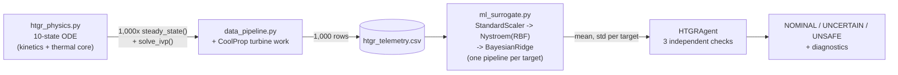
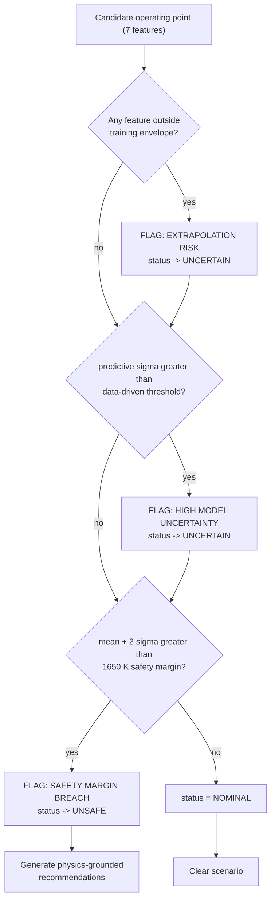

# HTGR Reactor Physics-to-ML Pipeline

> A nuclear reactor's coupled point-kinetics / 3-node thermal-core model, taken from a MATLAB/Simulink design study and rebuilt as a scalable, quantitative Python stack — stiff-ODE physics engine → Monte Carlo telemetry → probabilistic ML surrogate wrapped in an autonomous safety agent.


---

## Overview

This repository modernizes the reactor physics core of the **Imperial College London HTGR-5 / HR-5 project** (*"Scaled High Temperature Test Reactor Cogeneration for Zero Emission Hybrid-Desalination"*, March 2026) — a 300 MWth scaled High-Temperature Gas-Cooled Reactor (HTGR) design originally simulated in MATLAB/Simulink — into a modular, dependency-light Python pipeline.

Rather than a line-for-line port, this is a full re-architecture: the original `Calculate_Kinetics.m` and `core_thermals.m` Simulink blocks become a single stiff coupled ODE system solved with SciPy; a 1,000-run Monte Carlo sweep over realistic operating envelopes generates training telemetry with pandas; and a scalable kernel-approximation surrogate (scikit-learn) replaces the O(N³) cost of an exact Gaussian Process, wrapped in a small autonomous agent that makes an explicit accept/flag/reject safety call on every candidate operating point — with a documented reason why, every time.

Every number quoted below is from an actual run of this code, not an estimate.

## Core Architecture

### 1. `src/htgr_physics.py` — Stiff Coupled ODE Physics Engine
A direct translation of the report's 6-group point-kinetics and 3-node fuel/moderator/coolant thermal-core equations into a single 10-state ODE system (`P, C₁..C₆, T_fuel, T_moderator, T_coolant`), integrated with `scipy.integrate.solve_ivp` using the implicit **Radau** method — required because the ~1 ms prompt-neutron lifetime and the ~10²–10³ s moderator thermal timescale span more than five orders of magnitude. Initial conditions aren't guessed off a plot; `steady_state()` solves the 3×3 linear heat-balance system analytically for a self-consistent starting point at any operating condition. The literal source kinetics block has no temperature feedback and diverges under a sustained reactivity step — a Doppler/moderator feedback term was added (clearly labeled as an addition, not extracted report data) to make the model physically stable and usable downstream.

### 2. `src/data_pipeline.py` — Monte Carlo Telemetry Generator
Samples 1,000 operating points across realistic bounds (helium mass flow, coolant inlet temperature, reactivity step size/timing, turbine inlet/back pressure, isentropic efficiency), runs each through the physics engine from its own physically self-consistent steady state, then chains a **CoolProp-based helium turbine expansion** (a Python port of the report's `helium_turbine.m`) onto the reactor-outlet gas to compute turbine work. All 1,000 runs converged — 0 solver failures, 0 NaNs — and the results are structured into a clean pandas DataFrame and written to `data/htgr_telemetry.csv`.

### 3. `src/ml_surrogate.py` — Scalable Probabilistic Surrogate + Autonomous Agent
A full `GaussianProcessRegressor` scales as **O(N³)** in training-set size — it stops being usable well before you're generating tens of thousands of Monte Carlo rows. Each target here instead gets a `StandardScaler → Nystroem(RBF) → BayesianRidge` pipeline: **Nystroem approximates the RBF kernel's feature map with a small number of random components**, and `BayesianRidge` performs closed-form Bayesian linear regression on top of it — giving a genuine posterior **mean and standard deviation** at **O(N·k²)** cost instead of a full kernel-matrix factorization.

`HTGRAgent` wraps the trained surrogate with three independent, explicit checks on every candidate operating point:
- **Safety-margin breach** — predicted peak fuel temperature (mean + 2σ) against a 1650 K limit.
- **High model uncertainty** — a data-driven threshold derived from the surrogate's own held-out predictive-std distribution.
- **Autonomous diagnostic fallback: out-of-distribution / extrapolation guard** — a deterministic training-envelope check, added because Nystroem+BayesianRidge does **not** guarantee its self-reported uncertainty grows with distance from training data the way a true GP's does. When any check fires, the agent doesn't just flag it — it prints a root-cause diagnostic and generates physics-grounded recommendations (increase coolant flow, reduce reactivity insertion, lower inlet temperature) to pull the operating point back into a safe envelope.

### 4. `notebooks/HTGR_Analysis.ipynb` — Interactive Analysis Notebook
The visual walkthrough: an executive-summary narrative, exploratory scatter/heatmap analysis of the Monte Carlo telemetry, a predicted-vs-actual parity plot with **±2σ confidence bands** against a held-out test split, and the agent evaluating one in-distribution and one out-of-distribution scenario live in the notebook output. Built programmatically via `nbformat` and executed end-to-end (`jupyter nbconvert --execute`) before being committed, so every cell's output is verified to run clean.

## Results at a Glance

| | Peak Fuel Temperature | Turbine Work Output |
|---|---|---|
| Test R² | 0.9946 | 1.0000 |
| Test RMSE | 4.85 K | 0.0033 MW |
| Mean predictive σ | 4.88 K | 0.0025 MW |
| 95% CI coverage (±2σ) | 96.5% | 92.0% |

*(`turbine_work_MW` fitting to R²≈1.0 reflects that the telemetry comes from a deterministic simulator with no injected observation noise, not data leakage — turbine work is a smooth composition of the physics engine's output through CoolProp's helium enthalpy relations.)*

- **1,000 / 1,000** Monte Carlo simulations converged.
- Cross-validated hyperparameter search (`GridSearchCV`, 5-fold) over Nystroem `gamma` and `n_components` for each target independently.
- The `HTGRAgent` demo correctly clears a moderate in-distribution scenario (**NOMINAL**, 1485.6 K predicted) and correctly rejects a low-flow / hot-inlet / high-reactivity scenario (**UNSAFE**, 1806.1 K predicted), citing all three of its diagnostic checks simultaneously.

## Mathematical Deep Dive: ML Surrogate & `HTGRAgent`

This section exists because "we used a Gaussian Process approximation" is a sentence, not an explanation. Below is the actual math, the actual complexity argument, the actual decision logic, and the actual limitation of the approach — labelled end to end.

### 0. End-to-end workflow



### 1. Feature / target definitions

| Symbol | Column | Description | Training range |
|:---:|---|---|---|
| x₁ | `helium_mass_flow_kgs` | Primary-loop helium mass flow | 78 – 132 kg/s |
| x₂ | `coolant_inlet_temp_K` | Reactor coolant inlet temperature | 593.15 – 653.15 K |
| x₃ | `rho_insertion` | Reactivity step (absolute units; β_total = 0.0075) | −0.0030 – +0.0030 |
| x₄ | `rho_step_time_s` | Time at which the reactivity step is applied | 50 – 150 s |
| x₅ | `turbine_p_in_Pa` | Helium turbine inlet pressure | 6.3×10⁶ – 7.7×10⁶ Pa |
| x₆ | `turbine_p_back_Pa` | Helium turbine back pressure | 3.8×10⁶ – 5.0×10⁶ Pa |
| x₇ | `turbine_eta_is` | Turbine isentropic efficiency | 0.85 – 0.92 |
| y₁ | `peak_fuel_temp_K` | max(T_fuel(t)) over the 400 s simulated transient | *(target)* |
| y₂ | `turbine_work_MW` | Turbine work from the t = 400 s reactor-outlet gas state | *(target)* |

### 2. Why not just use an exact Gaussian Process?

A GP is the natural choice here because it's a distribution over functions with calibrated uncertainty built in. Given N training points, its posterior at a query x\* is:

$$\mu_*(x) = k(x)^\top (K + \sigma_n^2 I)^{-1} y \qquad\qquad \sigma_*^2(x) = k(x,x) - k(x)^\top (K + \sigma_n^2 I)^{-1} k(x)$$

where $K \in \mathbb{R}^{N\times N}$ is the Gram matrix ($K_{ij} = k(x_i,x_j)$ for the RBF kernel), $k(x)\in\mathbb{R}^N$ is the vector of kernel evaluations against every training point, and $\sigma_n^2$ is observation noise.

**The bottleneck is $(K+\sigma_n^2 I)^{-1}$.** Computing it exactly (Cholesky factorization) costs **O(N³)** time and **O(N²)** memory, plus O(N) per prediction for the mean and O(N²) for the variance. At N = 800 (this project's training split) that's trivial — but the entire point of choosing this architecture is that it has to survive a Monte Carlo sweep one or two orders of magnitude larger than 1,000 runs without a rewrite. At N = 50,000, O(N³) ≈ 1.25×10¹⁴ FLOPs: dead on arrival.

### 3. The Nyström approximation

The Nyström method replaces the full kernel with a **low-rank approximation** built from m ≪ N landmark points sampled from the training set (here m = `n_components` ∈ {100, 200, 300}, chosen by grid search):

$$K \;\approx\; K_{N,m}\,K_{m,m}^{+}\,K_{m,N}$$

where $K_{m,m}\in\mathbb{R}^{m\times m}$ is the small Gram matrix among the m landmarks and $K_{N,m}\in\mathbb{R}^{N\times m}$ holds the kernel evaluations between every training point and those landmarks. Concretely, scikit-learn's `Nystroem` transformer eigendecomposes $K_{m,m}=U\Lambda U^\top$ and builds an **explicit finite-dimensional feature map** $\varphi:\mathbb{R}^d\to\mathbb{R}^m$:

$$\varphi(x) = \Lambda^{-1/2}U^\top k_m(x), \qquad\qquad k(x,x') \approx \varphi(x)^\top\varphi(x')$$

This is the move that matters: it converts *nonlinear kernel regression* into **ordinary linear regression in an m-dimensional space**. Everything downstream — including the uncertainty — now scales with m, not N.

### 4. Bayesian Ridge on the Nyström features

With an explicit $\varphi(x)$, `BayesianRidge` fits a linear model with Gaussian priors on both the weights and the noise:

$$y = \varphi(x)^\top w + \varepsilon, \qquad \varepsilon\sim\mathcal{N}(0,\beta^{-1}), \qquad w\sim\mathcal{N}(0,\alpha^{-1}I)$$

Gamma hyperpriors on the noise precision β and weight precision α are resolved by evidence maximization (type-II maximum likelihood / empirical Bayes) directly from the data — no manually-tuned regularization constant. Given $\Phi\in\mathbb{R}^{N\times m}$ (the stacked Nyström features), the posterior over w is **closed-form**:

$$\Sigma_w = \left(\alpha I + \beta\,\Phi^\top\Phi\right)^{-1} \qquad\qquad \mu_w = \beta\,\Sigma_w\,\Phi^\top y$$

Forming $\Phi^\top\Phi$ costs O(N m²); inverting the resulting m×m matrix costs O(m³) — independent of N. For a new point x\*, with $\varphi_* = \varphi(x_*)$:

$$\hat{y}_* = \varphi_*^\top \mu_w \quad\text{(predictive mean)} \qquad\qquad \sigma_*^2 = \beta^{-1} + \varphi_*^\top \Sigma_w\,\varphi_* \quad\text{(predictive variance)}$$

This is exactly what `pipeline.predict(X, return_std=True)` returns — **verified directly** (see Debug Log §3) before it was trusted as the foundation of the whole uncertainty story. $\sigma_*^2$ has two components: $\beta^{-1}$ (irreducible/aleatoric noise) and $\varphi_*^\top\Sigma_w\varphi_*$ (epistemic uncertainty about the weights) — the second term is what *should*, in principle, grow as $\varphi_*$ moves away from the training feature distribution.

### 5. Complexity comparison

| | Exact GP | Nyström + BayesianRidge (this project) |
|---|:---:|:---:|
| Training time | O(N³) | O(N m² + m³) |
| Prediction time (mean) | O(N) | O(m) |
| Prediction time (variance) | O(N²) | O(m²) |
| Memory | O(N²) | O(N m + m²) |
| Uncertainty quality | Exact, for the chosen kernel | Approximate — see §6 |

At N=800, m≤300 this is already meaningfully cheaper; the gap becomes decisive (O(N³) vs. effectively O(N)) with every additional order of magnitude of Monte Carlo data.

### 6. The honest limitation — why the agent doesn't trust σ alone

$\varphi$ is built from a **fixed, global** set of m landmarks chosen once at training time. An exact RBF-kernel GP's uncertainty is *guaranteed by construction* to widen with distance from training data, because $k(x_*, x_i) \to 0$ for a stationary kernel as distance grows. A Nyström-approximated linear model offers **no such guarantee** — nothing forces $\varphi_*^\top\Sigma_w\varphi_*$ to grow smoothly outside the span of the training landmarks. This is a real, structural limitation of the approach, not a footnote, and it's the direct reason `HTGRAgent` was built with a second, independent, deterministic check rather than trusting the model's self-reported σ alone.

### 7. `HTGRAgent`: the exact conditional logic

Every call to `HTGRAgent.evaluate(scenario)` runs **three independent checks**, each capable of escalating the verdict:

**Check 1 — Deterministic extrapolation guard** (`HTGRSurrogate.out_of_bounds_features`)
```python
for col in FEATURE_COLUMNS:
    lo, hi = self.feature_bounds[col]   # exact min/max observed in the 800-row training split
    if not (lo <= features[col] <= hi):
        flagged.append(col)
```
If **any** of the 7 features falls outside the exact range seen during training, the point is extrapolation by definition — no statistics, just a bounds check. `status → UNCERTAIN`.

**Check 2 — Data-driven uncertainty threshold**
```python
uncertainty_threshold = mean(test_std) + 2 * std(test_std)
```
computed once, post-training, from the surrogate's own predictive-σ values across the held-out test set. A query's σ is flagged only when it's a statistical outlier *relative to how uncertain this model normally is* on legitimate in-distribution data — never against an arbitrary fixed number. `status → UNCERTAIN` (if not already worse).

**Check 3 — Safety-margin breach**
```python
fuel_upper_bound = fuel_mean + CONFIDENCE_Z * fuel_std   # Z = 2 -> ~97.7% one-sided bound
if fuel_upper_bound > FUEL_TEMP_SAFETY_MARGIN_K:          # 1650 K
    status = "UNSAFE"
```
Note this uses the **upper confidence bound**, not the raw mean — a scenario whose mean prediction sits under 1650 K but whose uncertainty band pushes the credible upper bound past it is still flagged unsafe. This check has teeth: it overrides everything else.



When status ≠ NOMINAL, `_recommend()` applies simple heuristics tied directly to the `core_thermals.m` energy balance — not a black-box output:

| Trigger | Recommendation | Physical mechanism |
|---|---|---|
| flow below the training midpoint | Increase `helium_mass_flow_kgs` | more convective heat removal ($2\dot{m}C_p(T_c-T_{in})$ term) |
| `rho_insertion` > 0 | Reduce the positive reactivity step | less fission heat generated ($Q_{fission}=P\cdot Q_{nominal}$) |
| inlet temp above the training midpoint | Lower `coolant_inlet_temp_K` | larger driving ΔT for heat removal |

An agent that just says "unsafe" is a classifier. An agent that says *why*, names the mechanism, and proposes a physically-motivated fix is closer to what an actual diagnostic tool needs to do.

## Quick Start

```bash
git clone <this-repo-url>
cd HTGR-ML-Optimization

python -m venv venv
source venv/bin/activate        # Windows: venv\Scripts\activate

pip install -r requirements.txt

# Regenerate the pipeline end-to-end (data/ and models/ are gitignored,
# not committed, so this is the first thing to run on a fresh clone).
python src/data_pipeline.py

# Train + save the surrogate. Must be run as an IMPORTED module, not a
# direct script - see "Known gotcha" below (get it wrong and the module
# itself will warn you and tell you the correct command).
python -c "from src.ml_surrogate import main; main()"

# Explore the results interactively
jupyter notebook notebooks/HTGR_Analysis.ipynb

# Or launch the live dashboard
streamlit run app.py
```

## Project Structure

```
HTGR-ML-Optimization/
├── src/
│   ├── __init__.py
│   ├── htgr_physics.py      # Point kinetics + 3-node thermal core (SciPy ODE)
│   ├── data_pipeline.py     # 1,000-run Monte Carlo telemetry -> CSV
│   └── ml_surrogate.py      # Nystroem+BayesianRidge surrogate + HTGRAgent
├── notebooks/
│   ├── HTGR_Analysis.ipynb          # Executive summary, EDA, uncertainty plots, agent demo
│   └── HTGR_Systems_Textbook.ipynb  # Postgraduate-style walkthrough: reactor -> cycles -> desal -> HR
├── app.py                   # Streamlit dashboard (live agent queries)
├── reference/               # Original source artifacts this repo modernizes (see below)
│   ├── FinalRollsRoyceHTGRImperialReport.pdf
│   └── FinalHTTRModel.slx
├── data/                    # Generated Monte Carlo telemetry (gitignored)
├── models/                  # Trained surrogate artifact (gitignored)
├── requirements.txt
└── README.md
```

## Engineering Debug Log

Translating a report into working code is never just transcription. This is the real, chronological record of what broke, how it was diagnosed, and how it was fixed — kept here deliberately rather than cleaned out of the history. Each entry follows Symptom → Root Cause → Fix → Verification → Lesson.

### 1. Open-loop reactivity divergence (~10⁴³ K)

| | |
|---|---|
| **Symptom** | The first end-to-end run of the coupled ODE — a literal translation of `Calculate_Kinetics.m` — produced a peak fuel temperature of **56,397,188,346,951,049,257,910,745,257,165,469,201,203,200 K** by t = 400 s. |
| **Investigation** | The appendix's `Calculate_Kinetics.m` takes reactivity `rho_in` as a bare function argument — no fuel/moderator temperature feedback term anywhere in its equations, despite the Simulink block diagram (Fig. 1) visually routing `Tf`/`Tm` into the kinetics block. |
| **Root cause** | This is *correct physics*, not a code bug: $\frac{dP}{dt}=\left(\frac{\rho-\beta}{\Lambda}\right)P+\sum\lambda_iC_i$ has no term that turns over on its own — a constant positive reactivity insertion below prompt-critical still produces unbounded exponential power growth on a stable reactor period unless something *external to the equation itself* forces ρ back down. |
| **Fix** | Added an explicit, clearly-labelled Doppler + moderator temperature feedback term (`doppler_feedback_reactivity`) as the *default* reactivity model. The literal feedback-free translation (`external_step_reactivity`) is kept available and documented as an addition beyond the source listing — not extracted report data. |
| **Verification** | Three targeted sanity checks before trusting the model further: (1) `steady_state()` is a true fixed point of the ODE (residual ≈ 1.8×10⁻¹⁴), (2) `equilibrium_precursors()` satisfies dC/dt = 0 in isolation (residual ≈ 4.4×10⁻¹⁶), (3) a negative reactivity step correctly drives power toward zero instead of diverging. |
| **Lesson** | Translate the equations exactly, then *test the equations* — a perfect 1:1 translation of an incomplete model is still an incomplete model. |

### 2. joblib + `__main__`: a bug with two heads

| | |
|---|---|
| **Symptom** | `jupyter nbconvert --execute` failed loading the trained surrogate: `AttributeError: Can't get attribute 'TargetModel' on <module '__main__'>`. |
| **Root cause** | `python src/ml_surrogate.py` executes the module as `__main__`; joblib pickles the `TargetModel`/`HTGRSurrogate` dataclasses under whatever module they were defined in *at pickle time* — here, `__main__`. The notebook imports the same file normally (as `ml_surrogate`), and pickle can't resolve `__main__.TargetModel` from there. |
| **First fix** | Regenerate the artifact via `from ml_surrogate import main; main()` instead of a direct script run, so the classes pickle under their real importable module path. |
| **Second head** | Adding `app.py` with `from src.ml_surrogate import ...` introduced a *third* possible module path — meaning one saved artifact could only ever satisfy one of {notebook, `app.py`} at a time, since the notebook was still on the bare `ml_surrogate` convention. |
| **Real fix** | Standardized the whole project on `src.ml_surrogate` (added `src/__init__.py`, updated the notebook's import cells, updated the README) **and** added a self-detecting guard inside `main()` — `if HTGRSurrogate.__module__ == "__main__":` — that prints the exact failure mode and the correct command, instead of silently saving an artifact that will fail somewhere else, later, in a different file. Verified the guard fires under the wrong invocation, then regenerated the correct artifact. |
| **Lesson** | A bug that reproduces under a slightly different trigger isn't a new bug — it's the same class of bug. Fix the class, not the instance: this failure mode is now self-diagnosing for good. |

### 3. Trusting an API before building on it

| | |
|---|---|
| **Risk** | The entire uncertainty-quantification story depends on `Pipeline.predict(X, return_std=True)` correctly forwarding `return_std` through a `Nystroem` transform step to `BayesianRidge.predict()` — documented behaviour, but not something to assume across scikit-learn versions without checking. |
| **What was done** | Before running the multi-minute `GridSearchCV` training pipeline, a 10-line isolated smoke test confirmed the kwarg passthrough actually worked in this environment's scikit-learn (1.9.0). |
| **Lesson** | Verify the load-bearing assumption in isolation before building the full system on top of it — a broken assumption discovered after a 5-minute grid search is a much more expensive bug to find. |

### 4. Sandbox / shell quirks

| | |
|---|---|
| **Symptom** | A single chained PowerShell command (write a throwaway script → run it → delete it) failed outright with `Remove-Item on system path '/' is blocked`, and the *entire* chain — including the initial file write — silently didn't execute. |
| **Root cause** | The command sandbox's static validation rejected the compound command before any of it ran. |
| **Fix** | Split "write," "run," and "clean up" into separate tool calls, and moved throwaway diagnostic scripts into a scratch directory outside the project folder, so cleanup wasn't even necessary. |

### 5. A caveat that was *not* "fixed" — by design

| | |
|---|---|
| **Observation** | At the full 300 MWth design point, the literal 3-node thermal core implies fuel/moderator temperatures (~1500–1800 K) well above the range shown in the report's own Fig. 3 literature-validation plot (~590–650 K). |
| **Investigation** | Fig. 3 validates the thermal-core block's *dynamic behaviour* against literature HTTR benchmark data, apparently at a different, smaller operating point than this project's 300 MWth design — the report doesn't give the numbers needed to reconcile the two. |
| **What was NOT done** | Quietly retuning constants to make the numbers "look right" against that figure. |
| **What was done instead** | Documented as an open discrepancy directly in `htgr_physics.py`'s module docstring, and reported plainly in every results summary produced during development. |
| **Lesson** | An honest, visible gap is worth more than a cosmetic fix that hides it — especially in a safety-adjacent model. |

## Original Source Material

The [`reference/`](reference/) folder contains the actual artifacts this repository modernizes — not reconstructed, not retyped:

- **[`reference/FinalRollsRoyceHTGRImperialReport.pdf`](reference/FinalRollsRoyceHTGRImperialReport.pdf)** — the full project report (Imperial College London, March 2026): literature review, reactor down-selection, Simulink methodology, DEEP economic analysis, and the complete MATLAB code appendices (`Calculate_Kinetics.m`, `core_thermals.m`, `helium_turbine.m`, `steam_turbine_measured.m`, `hybrid_desal_tvc.m`, `hrsg_boiler.m`) that `src/htgr_physics.py` and `src/data_pipeline.py` are direct translations of.
- **[`reference/FinalHTTRModel.slx`](reference/FinalHTTRModel.slx)** — the final Simulink model file itself (open in MATLAB/Simulink R2024b+ to see the original block diagram: Point Kinetics → Core Thermals → Helium Turbine → HRSG → Steam Turbine → Hybrid Desalination, matching Figs. 4–5 of the report).

Worth noting for anyone comparing the two side by side: the `.slx` file's `Calculate_Kinetics` block visually wires fuel/moderator temperature back into the kinetics block, but the *code inside that block* — reproduced verbatim in Appendix B — takes reactivity as a bare external input with no feedback arithmetic. That exact diagram-vs-code mismatch is what surfaced as Debug Log §1.

---

*Based on the reactor design and MATLAB/Simulink model from the Imperial College London HTGR-5 / HR-5 project report, "Scaled High Temperature Test Reactor Cogeneration for Zero Emission Hybrid-Desalination with Independent Water Heat Rejection" (March 2026).*
